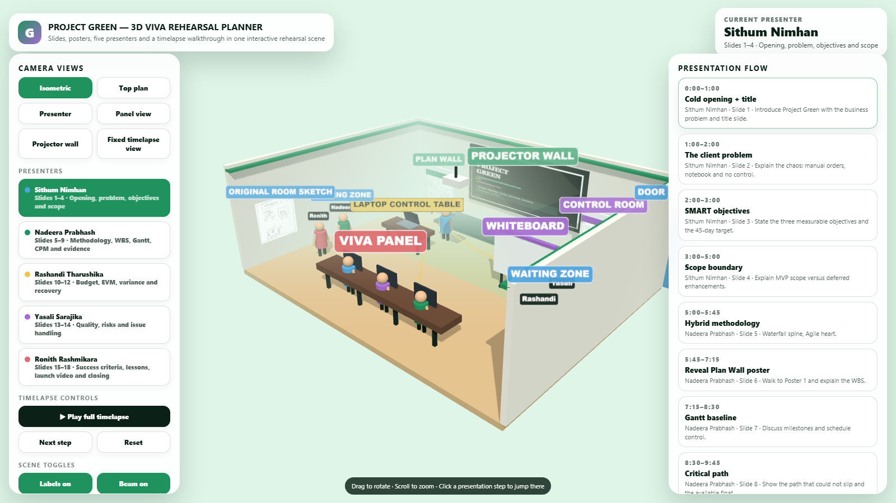
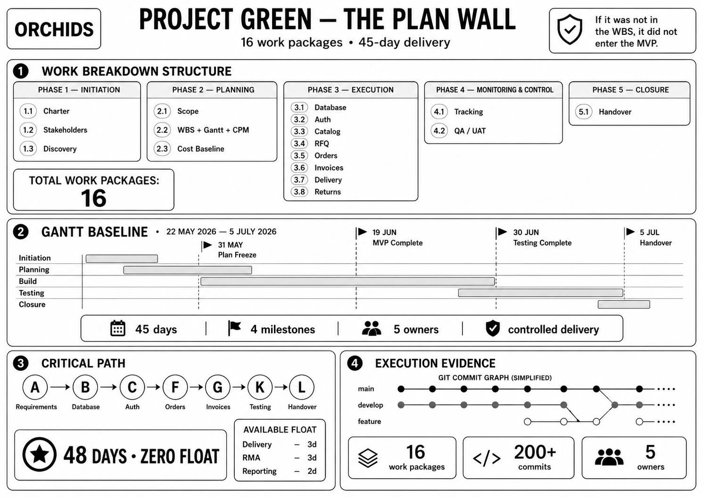
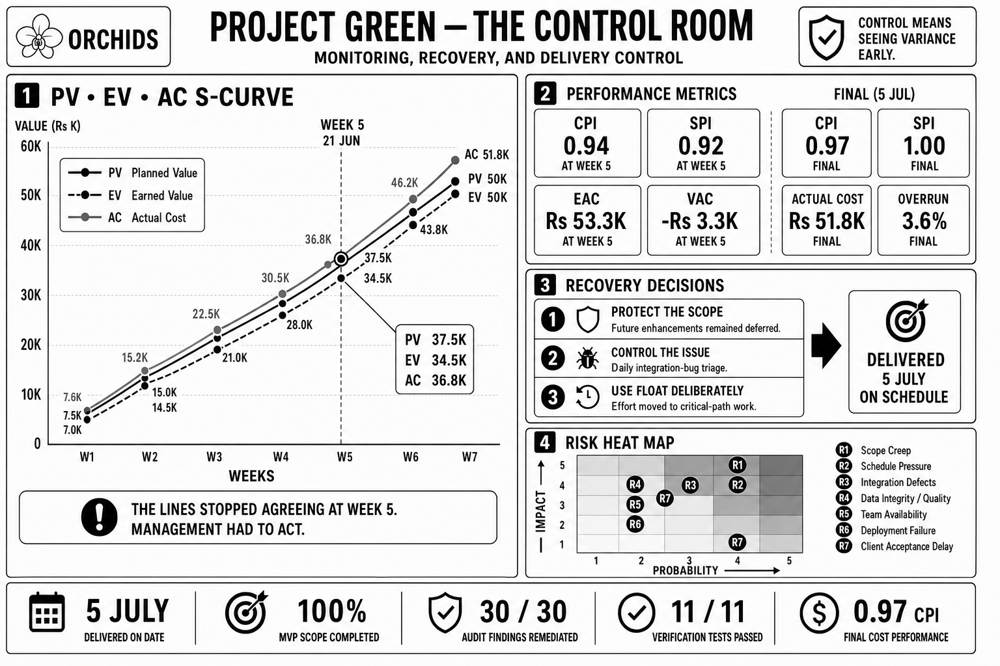
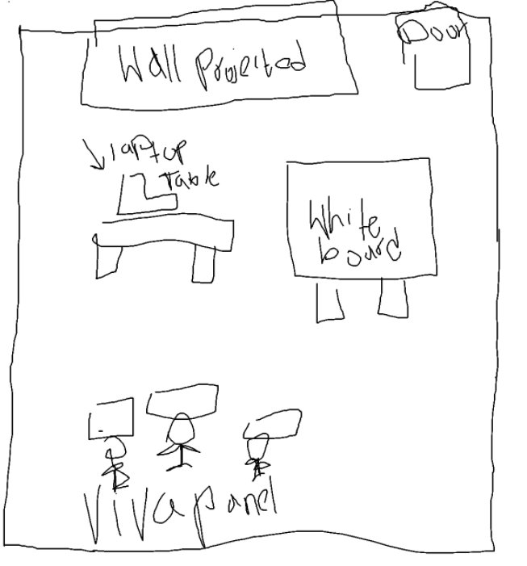
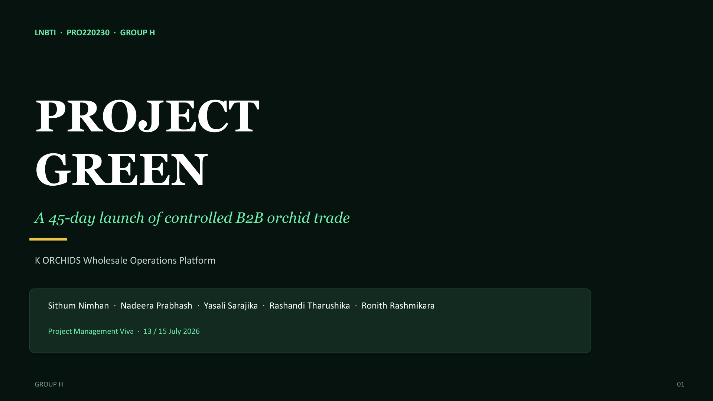
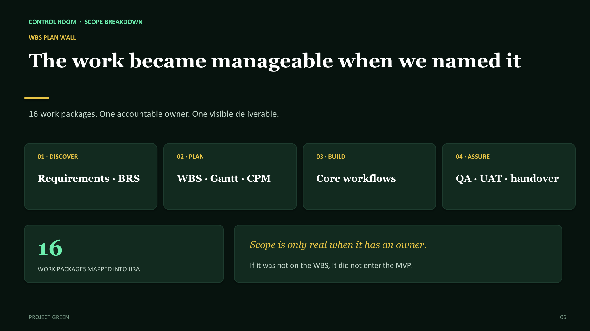

# Project Green — 3D Viva Rehearsal Planner

Interactive Three.js rehearsal scene for the **Project Green** viva: slides, posters, five presenters, and a full presentation timelapse in one room.

[](https://infinitebloom-max.github.io/project-green-3d-viva-planner/)


## Live site

**https://infinitebloom-max.github.io/project-green-3d-viva-planner/**

---

## Demo video

Full walkthrough of the 3D viva rehearsal planner (screen recording):

https://github.com/InfiniteBloom-max/project-green-3d-viva-planner/blob/main/docs/demo/viva-rehearsal-walkthrough.mp4

> Click the link above, then press **play** on GitHub’s video player.  
> Or download the file from [`docs/demo/viva-rehearsal-walkthrough.mp4`](docs/demo/viva-rehearsal-walkthrough.mp4).

---

## Screenshots

### Main interface — isometric room view



*Camera views, presenter list, timeline, and the full Project Green rehearsal room in one screen.*

### Room assets

| Plan Wall poster | Control Room poster | Original room sketch |
|:---:|:---:|:---:|
|  |  |  |

### Sample projector slides

| Opening | Plan Wall reveal |
|:---:|:---:|
|  |  |

---

## What's included

| Piece | Description |
|-------|-------------|
| `index.html` | Main interactive 3D planner |
| `slides/` | 18 deck slides as projector textures |
| `plan_poster.png` | Plan Wall poster visual |
| `control_poster.png` | Control Room poster visual |
| `sketch.png` | Original room sketch reference |
| `start_server.bat` | One-click local server (Windows) |
| `docs/demo/` | Screen-recording walkthrough |
| `docs/screenshots/` | README preview images |

## Features

- **Projector wall** shows the active slide for each timeline step
- **Plan Wall** and **Control Room** posters light up when they are the focus
- **Five presenters**, color-coded, with floating name tags
- **Timelapse** advances speaker, slide, position, and poster focus together
- **Fixed corner camera** during full timelapse so the whole room stays readable
- **Side waiting zones** keep non-active speakers out of the panel’s sightline
- Camera presets: isometric, top plan, presenter, panel, projector wall, fixed overview

## Presenters

1. **Sithum Nimhan** — slides 1–4 · opening, problem, objectives, scope
2. **Nadeera Prabhash** — slides 5–9 · methodology, WBS, Gantt, CPM, evidence
3. **Rashandi Tharushika** — slides 10–12 · budget, EVM, variance, recovery
4. **Yasali Sarajika** — slides 13–14 · quality, risks, issues
5. **Ronith Rashmikara** — slides 15–18 · success criteria, lessons, launch video, closing

## How to run

### Windows

1. Double-click `start_server.bat`
2. Open [http://localhost:8080](http://localhost:8080) in Chrome or Edge
3. Click **Play full timelapse** to walk the full sequence

### Any OS

```bash
python -m http.server 8080
# then open http://localhost:8080
```

> Three.js loads from jsDelivr — internet access is required.

## Controls

- **Drag** — orbit · **Scroll** — zoom · **Right-drag** — pan
- Click a **timeline step** to jump there
- Toggle **labels / beam / path / names** from the sidebar

## Changelog

### v4
- Fixed corner camera during *Play full timelapse* (stable overview, no isometric jumps)

### v3
- Waiting positions moved to left/right side zones so the panel can track the active speaker

### Earlier
- Local slides, real poster textures, five presenters, full presentation flow

## Future ideas

- Animated poster reveals
- Camera path exports
- Custom launch-video texture
- Voiceover cue markers

---

Built for Project Green viva rehearsal · [InfiniteBloom-max](https://github.com/InfiniteBloom-max)
